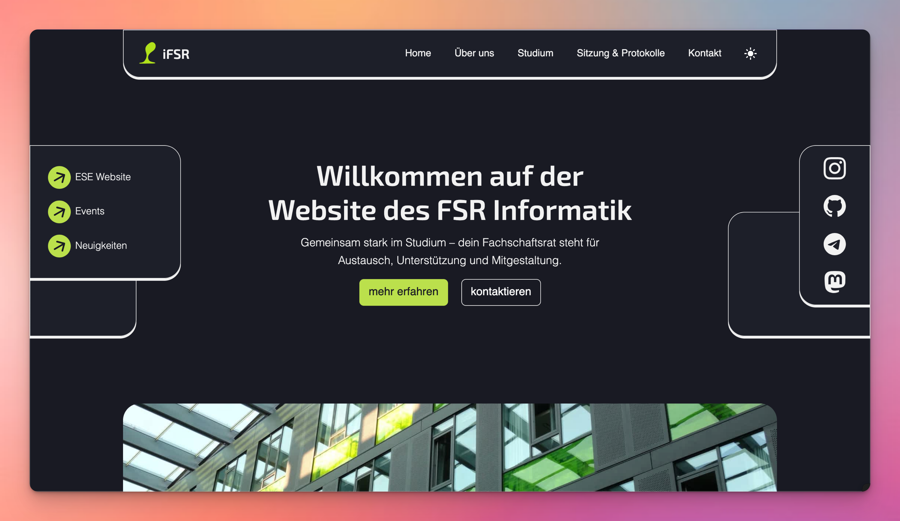
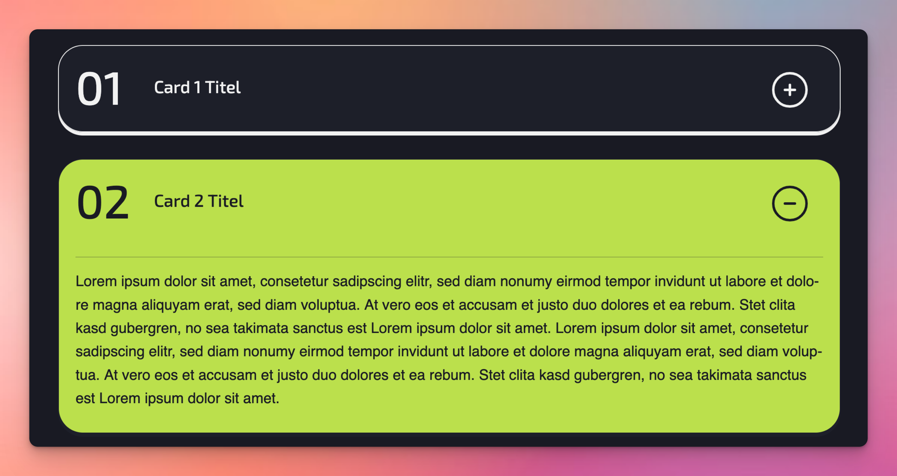
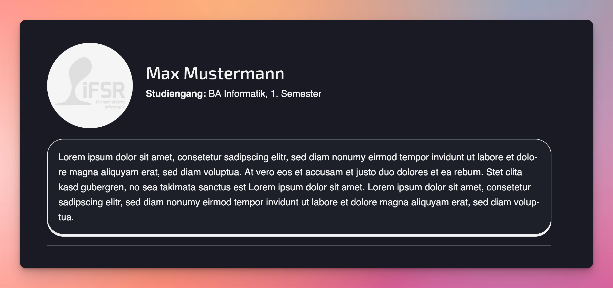

# iFSR Website – TU Dresden

[](LICENSE)
[](hugo.toml)


Dies ist die offizielle Website des iFSR (Informatik-Fachschaftsrat) der Technischen Universität Dresden. Die Seite
wurde mit dem statischen Website-Generator [Hugo](https://gohugo.io/) erstellt und dient als zentrale
Informationsplattform für Studierende der Fakultät Informatik.

## 🔧 Technologien

- **Framework:** [Hugo](https://gohugo.io/) – statischer Site-Generator
- **CSS-Framework:** [Bootstrap](https://getbootstrap.com/) – responsives Frontend-Toolkit
- **Decap-CMS:** [Decap](https://decapcms.org/) – Content-Management-System

## Lighthouse Performance


## 🚀 Schnellstart

### Hugo installieren

```bash
# macOS / Linux (mit Homebrew)
brew install hugo
```

```bash
# Windows (mit Chocolatey)
choco install hugo -y
```

Weitere Informationen findest du [hier](https://gohugo.io/getting-started/installing/).

### Projekt klonen und lokal starten

```bash
git clone ssh://git@ifsr.de/FSR/webseite.git
cd webseite

# Alias für die lokale Entwicklungsumgebung
alias hugodev='hugo server --disableFastRender --ignoreCache --noHTTPCache --cleanDestinationDir'

hugodev
```

Anschließend kannst du die Website im Browser unter [http://localhost:1313](http://localhost:1313) aufrufen.

> Hinweis: Stelle sicher, dass eine aktuelle Hugo version genutzt wird!

## 📁 Projektstruktur

- `content/` – Inhalte der Website (Seiten im Markdown Format)
- `layouts/` – Individuelle Layouts und Templates
- `static/` – Statische Dateien (z.B. Bilder, PDFs)
- `assets/` – CSS, JavaScript Dateien und Images
- `data/` – Navigation und Config-Dateien
- `hugo.toml` – Hauptkonfigurationsdatei für Hugo

## 📝 CMS

Diese Website nutzt [Decap CMS](https://decapcms.org/) als Content-Management-System. Damit können berechtigte Nutzer:innen Inhalte direkt über eine grafische Oberfläche im Browser bearbeiten – ganz ohne lokalen Zugriff oder technisches Vorwissen.

### Zugang zum CMS

Das CMS ist unter `/admin` erreichbar: [https://ifsr.de/admin](https://ifsr.de/admin). Die Anmeldung erfolgt über den Forgejo Account.

### Erste Schritte zur Bearbeitung

1. Rufe `/admin` im Browser auf.
2. Melde dich mit deinem Benutzerkonto an.
3. Wähle in der linken Navigation die gewünschte Inhaltskategorie (z.B. "About").
4. Klicke auf den Eintrag, den du bearbeiten möchtest.
5. Nimm Änderungen im Editor vor und speichere sie mit "Publish".

### Hinweise

- Änderungen werden direkt im `content/` Verzeichnis gespeichert (als Markdown-Dateien im Git-Repository).
- Das CMS spiegelt die Navigation basierend auf den vorhandenen Inhalten und Konfigurationen wider. Achte daher darauf, dass Änderungen sowohl im `GER` als auch im `ENG` Verzeichnis durchgeführt werden.
- Für neue Inhaltstypen oder angepasste Nav-Strukturen müssen ggf. Anpassungen an der Datei `static/admin/config.yml` vorgenommen werden.

## 💡 Entwicklungs-Hinweise

### Neue Seite anlegen (inkl. Navbar)

1. Erstelle neue Markdown-Dateien (.de und .en für Mehrsprachigkeit) innerhalb von `content/`, z.B.:

- `content/team.de.md`
- `content/team.en.md`

2. Füge in der Datei ein Front-Matter hinzu:

   ```markdown
   ---
   title: "Title"
   draft: false
   url: /site/subsite/
   ---
   ```

3. Trage die Seite in der Navigationsstruktur ein, indem du sie in `navigation_de.toml` und `navigation_en.toml` ergänzt:

   ```toml
   [[menu.main]]
   name = "Team"
   url = "/about/team"
   weight = 6
   ```

4. Bei Bedarf kannst du durch Verschachtelung Unterseiten eines Menüpunkts einordnen:

   ```toml
   [[menu.main]]
   parent = "Team"
   name = "Team Liste"
   url = "/team/teamlist"
   weight = 1
   ```

---

### Seite bearbeiten (Content/Markdown)

1. Öffne die entsprechende `.md`-Datei im `content/`-Verzeichnis.
2. Bearbeite den Inhalt im Markdown-Format.
3. Änderungen werden durch `hugodev` automatisch neu geladen.

---

### Shortcode Snippets

Du kannst Code Snippets in deine Markdown Files integrieren, um die Website interaktiver zu gestalten. Nachfolgend
findest du hierfür eine Anleitung.

#### Image

```

```

#### Details



```


{{ .Content }}


```

#### Profile



```



```

## 📬 Kontakt

Bei Fragen oder Vorschlägen zur Website kontaktiere uns gerne:

- 📧 E-Mail: [fsr@ifsr.de](mailto:fsr@ifsr.de)
- 🌐 Website: [https://ifsr.de](https://ifsr.de)

Bei spezifischen Fragen zum Sourcecode kontaktiere:

- [jannik.menzel@ifsr.de](mailto:jannik.menzel@ifsr.de)

## Lizenz
Der Sourcecode dieses Projektes ist unter der MIT Lizenz lizenziert. Details dazu findest du in der `LICENSE` Datei.
